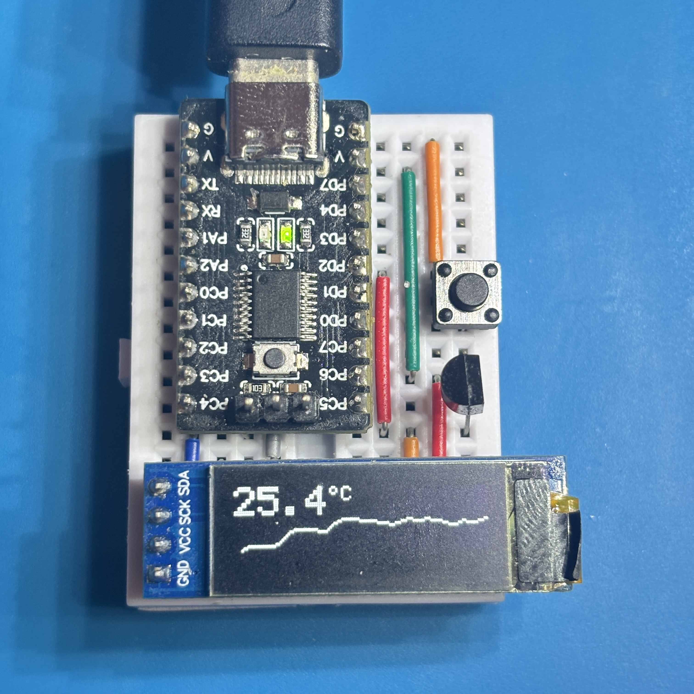
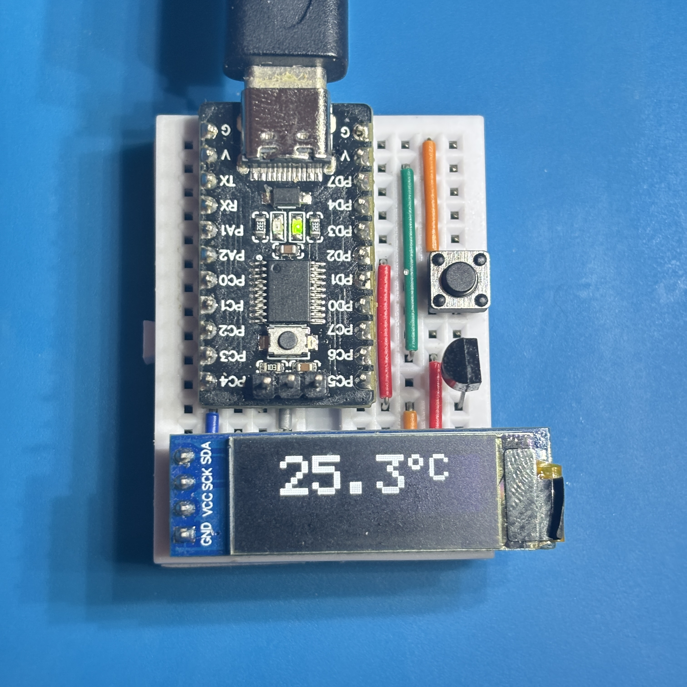
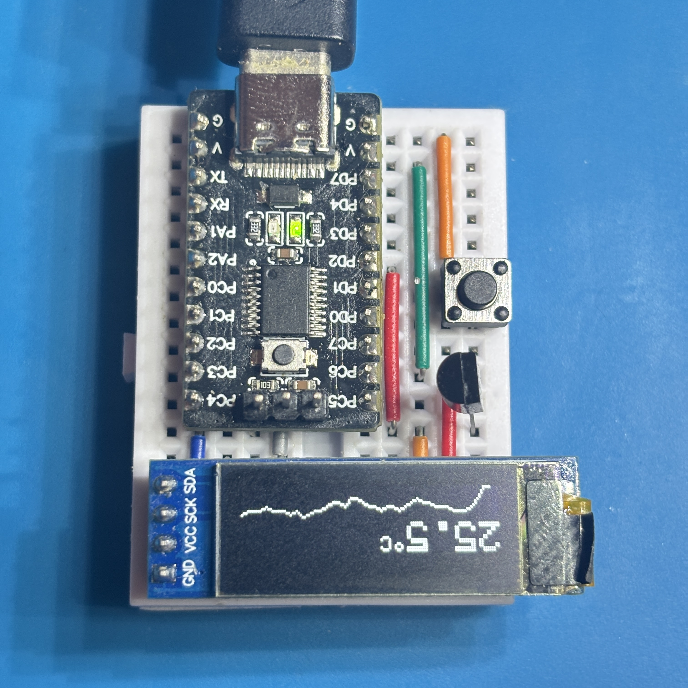
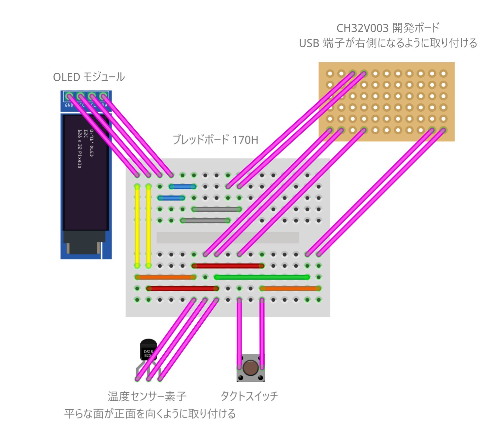

# Arduino: CH32V003-Thermometer

グラフ表示に対応したコンパクトな温度計です。



温度のグラフ表示とテキスト表示、および上下反転表示に対応しています。

<div>



</div>

## 部材

| 種別 | 型番など | 数量 |
|:-----|:---------|:-----|
| ブレッドボード | 170H | 1個 |
| ジャンパーワイヤ | - | 11本 |
| タクトスイッチ | 2P 6x6mm | 1個 |
| マイコン | CH32V003 開発ボード | 1個 |
| OLED モジュール | 0.91" 128x32 | 1個 |
| 温度センサー | DS18B20 | 1個 |

## 配線図



## プログラム開発環境

### 統合開発環境

| 名前 | 説明 |
|:-----------|:-----|
| Arduino IDE | 統合開発環境 |

**インストール**:
1. 公式サイト [https://www.arduino.cc/en/software/#ide](https://www.arduino.cc/en/software/#ide) からダウンロード・インストール

### ボードサポートパッケージ

| 名前 | 説明 |
|:------|:-----|
| CH32V RISC-V Arduino | ボードサポートパッケージ |

**インストール**:
1. Arduino IDE の「ファイル」→「環境設定」→「追加のボードマネージャのURL」に以下を追加:
   ```
   https://github.com/openwch/board_manager_files/raw/main/package_ch32v_index.json
   ```
2. ボードマネージャーで「CH32V」を検索・インストール

### 依存ライブラリ

| ライブラリ | 説明 |
|:-----------|:-----|
| DigitalButton | タクトスイッチ制御 |

**インストール**: Arduino IDEのライブラリマネージャーで検索・インストール

## 操作

マイコンに電源を供給すると作動します。
定期的に温度を測定して、OLED に表示します。

ボタンを押すと、表示パターンが切り替わります。


ボタンを長押しすると、表示が上下反転します。


## ライセンス

このプロジェクトは [MIT ライセンス](./LICENSE) の下で公開されています。
自由に使用、改変、再配布していただけます。
